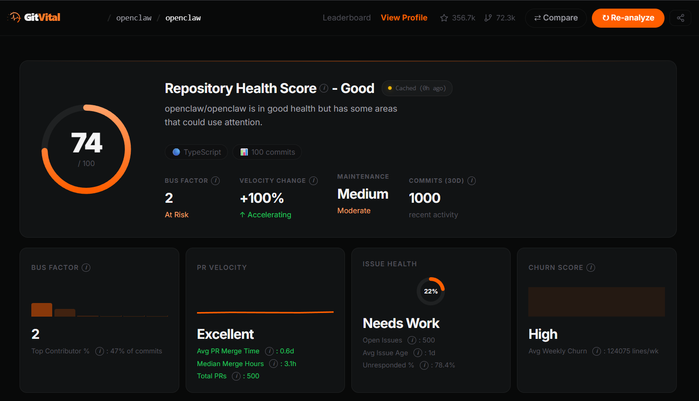
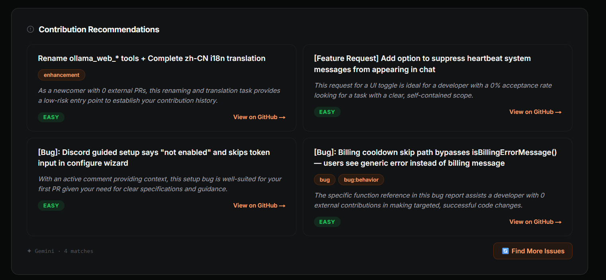
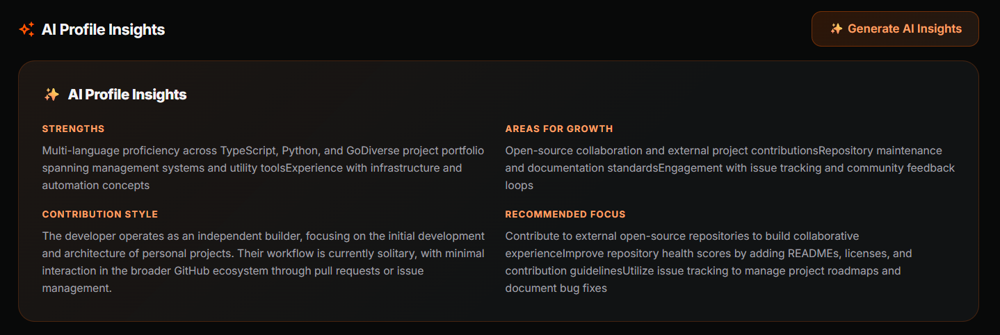
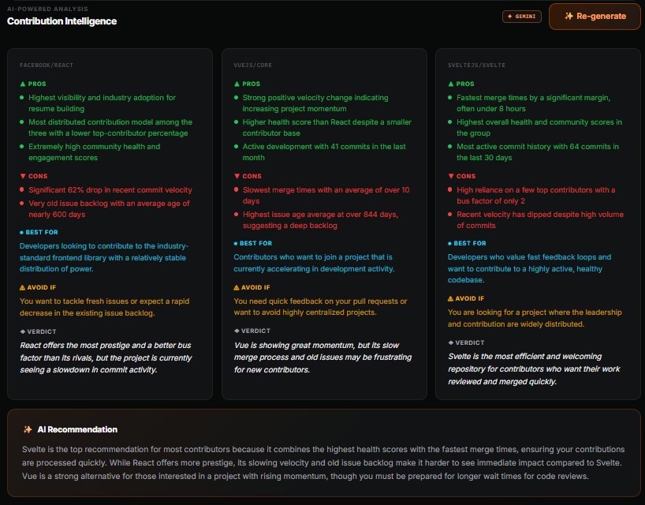

<div align="center">
  

  <p><strong>GitHub Repository Health & Maintainer Analytics Pipeline</strong></p>

</div>

<br />

<div align="center">
  <em>Is this open-source library healthy or slowly dying? GitVital answers that question.</em>
</div>

<div align="center">
  💡 <strong>Quick Start:</strong> Replace <code>github.com</code> with <code>gitvital.com</code> in any repo URL to instantly analyze it.
</div>

<br />

## Screenshots


<div align="center">
  
  <p><em>Main Dashboard showing Repository Health Score, Risk Flags, and Metric Trends.</em></p>
</div>

<div align="center">
  
  <p><em>AI Issue Recommender matching developer patterns with ideal "next issue" to fix.</em></p>
  
  
  <p><em>AI profile insights for a developer.</em></p>
</div>

<div align="center">
  
  <p><em>Repository Comparison Tool evaluating competing libraries with AI Contribution Intelligence.</em></p>
</div>

## Overview

**GitVital** is a specialized data ingestion and analytics pipeline that evaluates the health, sustainability, and maintainability of public GitHub repositories. 

Developers manually check commit dates and open issue counts when evaluating open-source dependencies. GitVital automates and deeply expands this process by converting raw GitHub GraphQL data into a multi-variable **Health Score (0-100)**, alongside actionable intelligence like Bus Factor, PR Turnaround Time, and Code Churn.

It also gamifies open-source contributions by aggregating a **Developer Health Score** for maintainers, ranking them on a global leaderboard based on the health of their projects, and leveraging AI to help them grow and find their next contribution.

## Core Features

- **The Health Score:** A 0-100 composite score weighted by commit activity, contributor diversity, PR responsiveness, issue backlog management, and code churn.
- **Risk Flags:** Automated, plain-English warnings generated from metrics (e.g., *⚠️ PR REVIEW DELAYED: Average merge time is 14 days*).
- **AI-Powered Advice for Repos:** Personalized coaching tips and strategies generated from repository metrics to help maintainers improve their project's health.
- **AI Repository Comparison Insights:** Deep-dive AI intelligence comparing two repositories side-by-side, explaining the nuanced story behind why metrics differ (e.g., why library A's bus factor might be inherently different than library B's).
- **Gamified Developer Profiles:** Aggregated metrics across a user's repositories to calculate a global percentile ranking, featuring unlockable achievement badges.
- **AI Developer Persona Insights:** Deep analysis of a developer's GitHub history to establish a personalized behavioral persona (e.g., "The Open Source Architect") detailing core strengths and coding patterns.
- **AI Issue Recommender:** Matches a developer's historical coding patterns, typical tech stack, and experience level with open, unassigned global repository issues, finding them the exact ideal "next issue" to fix.
- **Embeddable SVG Badges:** Dynamic health badges that maintainers can embed directly into their repository `README.md` files.

## Technical Architecture

GitVital is built as an asynchronous data pipeline designed to handle extensive third-party API rate limits and complex data aggregation.

> **Note:** Place diagram in `./docs`
<div align="center">
  <!--  -->
  <p><em>GitVital Architecture: Next.js, Express, BullMQ, Redis, PostgreSQL. (Placeholder)</em></p>
</div>

**Tech Stack:**
- **Frontend:** Next.js 14, Tailwind CSS, Recharts / D3.js
- **Backend:** Node.js, Express.js
- **Database:** PostgreSQL (with Prisma ORM), Redis
- **Queueing / Workers:** BullMQ
- **External AI:** Gemini AI API for User/Repo Insights and Issue Recommendations
- **External Services:** GitHub GraphQL API v4, REST API

<details>
<summary><strong>Engineering Challenges Solved</strong> (Click to expand)</summary>

#### 1. Overcoming Strict 3rd-Party API Rate Limits
GitHub's GraphQL API strictly limits authenticated users to 5,000 points per hour. A naive implementation querying deep historical data would consume this on a single large repository. 
- **Solution:** Implemented adaptive rate-limit monitoring within the BullMQ worker that intelligently calculates wait times based on GitHub's `resetAt` timestamps, automatically backing off before limits are hit.
- **Enforced Limits:** Analysis is capped at the last 12 months, analyzing up to 1,000 commits, 500 PRs, and 500 issues per repository to ensure predictable API consumption.

#### 2. Asynchronous Worker pipeline
Fetching paginated data via GraphQL takes significant time. Keeping the HTTP request open would cause timeouts and poor UX.
- **Solution:** Integrated **BullMQ** (running on Redis) to offload ingestion and computation to separate Node.js worker processes (e.g., `repoAnalyzer`, `userAnalyzer`). The Next.js frontend polls for the job status (`queued`, `processing`, `done`) and seamlessly renders the dashboard once the background worker finishes.
- **Idempotent Queueing:** Robust deduplication logic ensures that repeated requests for the same repository or user don't flood the queue with redundant jobs.

#### 3. Defensive Pagination Handling
GitHub's cursor-based pagination can be brittle, occasionally returning empty nodes while indicating a `hasNextPage`.
- **Solution:** Built bulletproof while-loops with explicit infinite-loop guards (checking if cursors change) and hard iteration limits to guarantee reliable data fetching across thousands of commits.

#### 4. Complex Data Aggregation (Leaderboards & Matchmaking)
Ranking developers globally based on aggregated repository metrics requires intensive calculation, as does matching developer styles with suitable repo issues.
- **Solution:** Leveraged PostgreSQL window functions (`PERCENT_RANK()`, `RANK()`) against a **Materialized View** that is refreshed incrementally via a scheduled Cron job. This ensures that leaderboard queries on the frontend remain lightning fast (O(1) read time) regardless of the number of users.

#### 5. Intelligent Multi-Tier Quota & Cost Management for AI
Running multi-layered LLM analyses scaling across thousands of users and repos runs high risks of unbounded API costs.
- **Solution:** Built a global custom quote telemetry and gating system for the Gemini API that rigorously monitors usage limits and intelligently falls back to purely rule-based analysis (e.g., standard heuristics) if the target budget is hit or API rates exceed provisions.

#### 6. Multi-Variable Scoring Algorithm
Designing a metric that accurately reflects "health" requires nuanced handling of missing or sparse data (e.g., repositories that don't use Pull Requests).
- **Solution:** Built a pure-function metrics engine that dynamically redistributes scoring weights if a particular metric (like PR Turnaround Time) is missing, ensuring the final 0-100 score remains mathematically sound and fair.

</details>

## How GitVital Compares

We believe in transparency. Several great tools exist in the GitHub analytics space, and we want to be upfront about the landscape — what overlaps, and what we're doing differently.

### The Landscape

| Tool | What it does | How we differ |
|---|---|---|
| [repopulse.dev](https://repopulse.dev) | Repo health scores, bus factor, contributor charts | Similar core metrics — but no comparison tool, AI profiling, issue matchmaking, gamification, or embeddable badges |
| [OSS Insight](https://ossinsight.io) | Massive GitHub event explorer (10B+ events) | Data explorer, not a health analyzer. No health scores, AI insights, or developer scoring |
| [GitPulse](https://gitpulse.xyz) | Repo analytics, health scores, commit heatmaps, repo comparison | Closest metric overlap — but no AI intelligence layer, issue matching, user gamification, or developer persona profiles |
| [CodeScene](https://codescene.com) | Enterprise code quality & behavioral analysis | Different category. Focuses on code maintainability for engineering orgs, not project/maintainer health with AI suggestions |
| [Cauldron](https://cauldron.io) | Open-source community analytics (GrimoireLab) | Multi-platform community analysis for foundations. No health scores, no AI features |
| [RepoTracker](https://githubtracker.com) | Basic GitHub stats with charts | Simple stats viewer. No health scores, AI capabilities, or matchmaking |
| [Repo Doctor](https://github.com/nicepkg/repo-doctor) | CLI-based repo health audit | CLI tool for one-time audits, not an AI-powered web platform |

### Feature Overlap Matrix

✅ = Has it &emsp; ⚠️ = Partial &emsp; ❌ = Doesn't have it

| Feature | **GitVital** | repopulse.dev | OSS Insight | GitPulse | CodeScene |
|---|:---:|:---:|:---:|:---:|:---:|
| Health Score (0-100) | ✅ | ✅ | ❌ | ✅ | ✅ |
| Bus Factor | ✅ | ✅ | ❌ | ❌ | ✅ |
| PR Merge Time Analysis | ✅ | ❌ | ✅ | ✅ | ✅ |
| Risk Flags (plain English) | ✅ | ❌ | ❌ | ❌ | ⚠️ |
| Repo vs Repo Comparison | ✅ | ❌ | ✅ | ✅ | ❌ |
| AI Tooling & Intelligence | ✅ | ⚠️ | ❌ | ❌ | ✅ |
| **AI Developer Personas** | ✅ | ❌ | ❌ | ❌ | ❌ |
| **AI Issue Recommender** | ✅ | ❌ | ❌ | ❌ | ❌ |
| **AI Compare Insights** | ✅ | ❌ | ❌ | ❌ | ❌ |
| **Developer Health Score** | ✅ | ❌ | ❌ | ❌ | ❌ |
| **Gamified Badges** | ✅ | ❌ | ❌ | ❌ | ❌ |
| **Global Leaderboard** | ✅ | ❌ | ❌ | ❌ | ❌ |

### What Makes This Project Different

The core analytics (commits, PRs, issues, contributors) are table stakes — most tools compute these. Where GitVital diverges is the **Deep AI & Developer-Centric Gamification layer**:

- **AI Developer Intelligence** — AI profiles a developer's history, tells them their strengths, and proactively finds them the best next GitHub issue they should work on based on their skillset.
- **AI Repository Analysis** — Rather than just showing a chart, AI provides deeply thoughtful analysis on *why* a repo's metrics look the way they do, directly actionable towards maintainers.
- **Developer Health Score** — Aggregating metrics across all of a user's repositories into a single profile score. No existing tool does this.
- **Gamified Achievement Badges** — Unlockable badges like *"The Speedster"* (< 2hr PR merge time) and *"The Closer"* (50+ resolved issues). Designed to drive engagement the way Spotify Wrapped drives sharing.
- **Global Leaderboard** — Percentile rankings using PostgreSQL window functions. "You're better than 90% of developers on GitVital."
- **Embeddable SVG Badges** — Dynamic health badges for READMEs. Every badge is organic distribution.

Together, these features turn GitVital from a passive analytics dashboard into an incredibly sticky engagement and growth platform for developers.

## Getting Started (Local Development)

GitVital supports comprehensive environments for both general contributors and closer-to-production testing.

### Quick Start

1. **Clone the repo and enter the project directory:**
   ```bash
   git clone https://github.com/GitVital/GitVital.git
   cd GitVital
   ```

2. **Install dependencies in `backend` and `frontend`:**
   ```bash
   cd backend && npm install
   cd ../frontend && npm install
   ```

3. **Configure the Environment:**
   Run `cp backend/.env.example backend/.env` and update the core connection strings including your local Redis, Postgres, GitHub OAuth IDs, and Gemini AI Key.

For the definitive local setup guide (detailing Database Bootstrap, Redis via Docker vs system process, and multi-terminal command flows), please consult the **[SETUP.md](./SETUP.md)**.

## Contributing

We heartily welcome contributions of all kinds! Whether it's picking up an open issue, enhancing documentation, or proposing new features.

Before creating a PR, please read our **[CONTRIBUTING.md](./CONTRIBUTING.md)** to understand our contribution guidelines, how to format commit messages, and the code conventions we adhere to.

## Security Reporting

If you discover a security vulnerability, please do **not** open a public issue.
Follow the private reporting processes documented in **[.github/SECURITY.md](.github/SECURITY.md)**.

---

<div align="center">
  <em>Built with Next.js, Node.js, PostgreSQL, Redis, BullMQ, Gemini AI, and the GitHub GraphQL API.</em>
</div>
