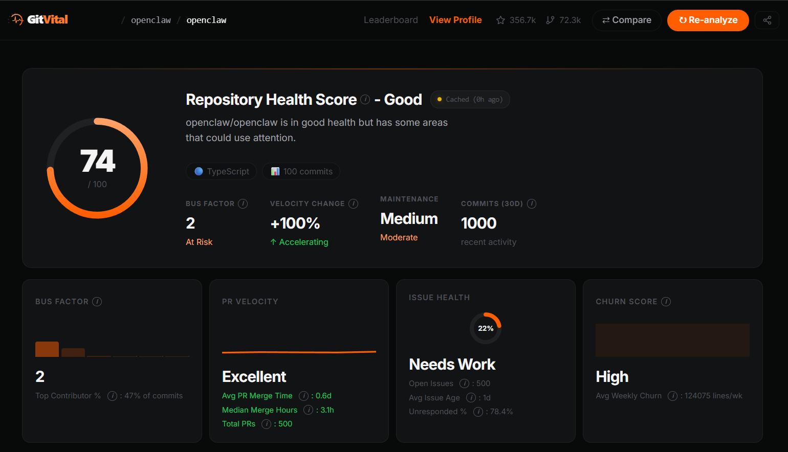
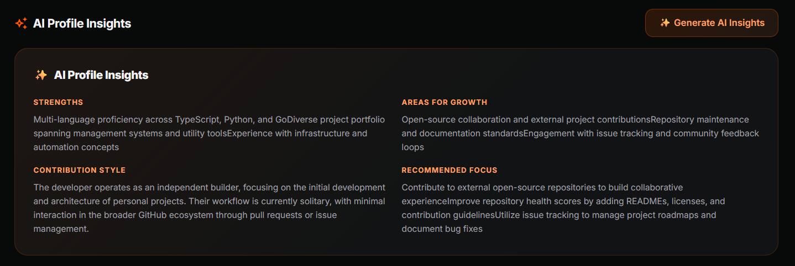
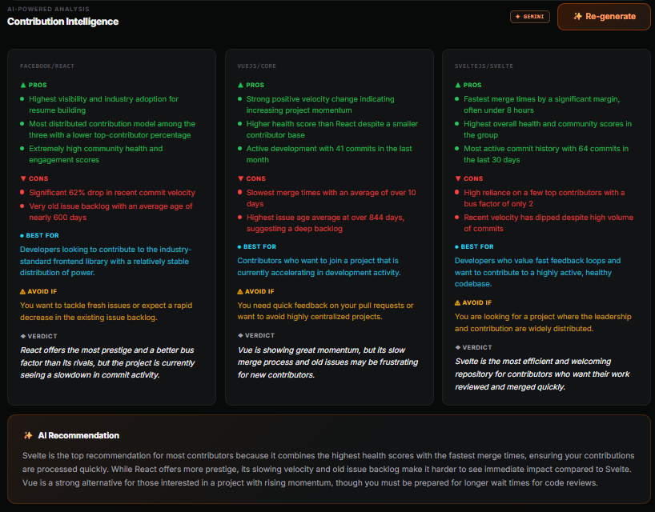
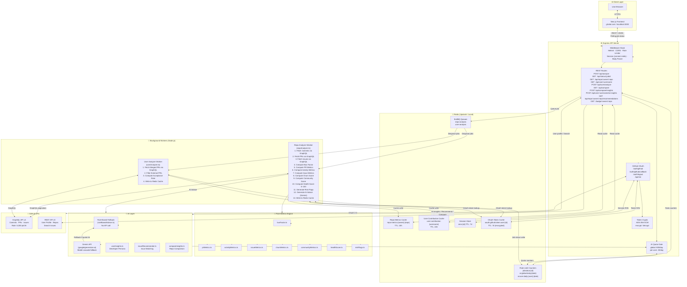

<div align="center">
  

  <p><strong>GitHub Repository Health & Maintainer Analytics Pipeline</strong></p>

</div>

<br />

<div align="center">
  <em>Is this open-source library healthy or slowly dying? GitVital answers that question.</em>
</div>

<div align="center">
  💡 <strong>Quick Start:</strong> Replace <code>github.com</code> with <code>gitvital.com</code> in any repo URL to instantly analyze it.
</div>

<br />

## Project Cost

- **Total spent to build, deploy, and run:** <strong><code>$0.00</code></strong>
- **Built with:** Free tiers, stubborn optimism, and too many late-night commits.

## Screenshots


<div align="center">
  
  <p><em>Main Dashboard showing Repository Health Score, Risk Flags, and Metric Trends.</em></p>
</div>

<div align="center">
  

  <p><em>AI Issue Recommender matching developer patterns with ideal "next issue" to fix.</em></p>
  
  
  <p><em>AI profile insights for a developer.</em></p>
</div>

<div align="center">
  
  <p><em>Repository Comparison Tool evaluating competing libraries with AI Contribution Intelligence.</em></p>
</div>

## Overview

**GitVital** is a specialized data ingestion and analytics pipeline that evaluates the health, sustainability, and maintainability of public GitHub repositories. 

Developers manually check commit dates and open issue counts when evaluating open-source dependencies. GitVital automates and deeply expands this process by converting raw GitHub GraphQL data into a multi-variable **Health Score (0-100)**, alongside actionable intelligence like Bus Factor, PR Turnaround Time, and Code Churn.

It also gamifies open-source contributions by aggregating a **Developer Health Score** for maintainers, ranking them on a global leaderboard based on the health of their projects, and leveraging AI to help them grow and find their next contribution.

## Core Features

- **The Health Score:** A 0-100 composite score weighted by commit activity, contributor diversity, PR responsiveness, issue backlog management, and code churn.
- **Risk Flags:** Automated, plain-English warnings generated from metrics (e.g., *⚠️ PR REVIEW DELAYED: Average merge time is 14 days*).
- **AI-Powered Advice for Repos:** Personalized coaching tips and strategies generated from repository metrics to help maintainers improve their project's health.
- **AI Repository Comparison Insights:** Deep-dive AI intelligence comparing two repositories side-by-side, explaining the nuanced story behind why metrics differ (e.g., why library A's bus factor might be inherently different than library B's).
- **Gamified Developer Profiles:** Aggregated metrics across a user's repositories to calculate a global percentile ranking, featuring unlockable achievement badges.
- **AI Developer Persona Insights:** Deep analysis of a developer's GitHub history to establish a personalized behavioral persona (e.g., "The Open Source Architect") detailing core strengths and coding patterns.
- **AI Issue Recommender:** Matches a developer's historical coding patterns, typical tech stack, and experience level with open, unassigned global repository issues, finding them the exact ideal "next issue" to fix.
- **Embeddable SVG Badges:** Dynamic health badges that maintainers can embed directly into their repository `README.md` files.

## Technical Architecture

GitVital is built as an asynchronous data pipeline designed to handle extensive GitHub API rate limits and real-time data aggregation — all without a traditional database. Everything is powered by Redis.

### System Architecture Diagram


```mermaid
flowchart TD
    subgraph CLIENT["🌐 Client Layer"]
        BROWSER["User Browser"]
        FE["Next.js Frontend\ngitvital.com / localhost:3000"]
    end

    subgraph API["⚙️ Express API Server\napi.gitvital.com / localhost:8080"]
        direction TB
        MW["Middleware Stack\nHelmet · CORS · Rate Limiter\nSession (connect-redis) · Body Parser"]
        ROUTES["REST Routes\nPOST /api/analyze\nGET  /api/status/:jobId\nGET  /api/repo/:owner/:repo\nGET  /api/user/:username\nPOST /api/user/analyze\nGET  /api/compare\nPOST /api/compare/insights\nPOST /api/user/:username/ai-insights\nGET  /api/repo/:owner/:repo/recommendations\nGET  /badge/:owner/:repo"]
        AUTH["GitHub OAuth\n/auth/github\n/auth/github/callback\n/auth/logout\n/api/me"]
        QUOTA["AI Quota Gate\nglobal: 800/day\nper-user: 20/day"]
        CRYPTO["Token Crypto\nAES-256-GCM\nencrypt / decrypt"]
    end

    subgraph REDIS["🔴 Redis (Upstash / Local)"]
        direction TB
        BQ["BullMQ Queues\nrepo-analysis\nuser-analysis"]
        RCACHE["Repo Metrics Cache\nrepo:metrics:{owner}:{repo}\nTTL: 24h"]
        UCACHE["User Contribution Cache\nuser:contribution:{username}\nTTL: 24h"]
        SESS["Session Store\nsess:{id}  TTL: 7d"]
        TOKCACHE["OAuth Token Cache\noauth:github:token:user:{id}\nTTL: 7d (encrypted)"]
        RATELIM["Rate Limit Counters\njobstatus:{id}\nai:global:daily:{date}\nai:user:daily:{user}:{date}"]
    end

    subgraph WORKERS["🔧 Background Workers (Node.js)"]
        direction TB
        RW["Repo Analyzer Worker\n(repoAnalyzer.ts)\n1. Fetch Commits via GraphQL\n2. Fetch PRs via GraphQL\n3. Fetch Issues via GraphQL\n4. Compute Bus Factor\n5. Compute PR Metrics\n6. Compute Activity Metrics\n7. Compute Issue Metrics\n8. Compute Churn Score\n9. Compute Community Score\n10. Compute Health Score 0–100\n11. Generate Risk Flags\n12. Generate AI Advice (Gemini)\n13. Write to Redis Cache"]
        UW["User Analyzer Worker\n(userAnalyzer.ts)\n1. Fetch Merged PRs via GraphQL\n2. Filter External PRs\n3. Compute Acceptance Rate\n4. Write to Redis Cache"]
    end

    subgraph METRICS["📐 Pure Metrics Engine"]
        direction LR
        BF["busFactor.ts"]
        PR["prMetrics.ts"]
        ACT["activityMetrics.ts"]
        ISS["issueMetrics.ts"]
        CHN["churnMetrics.ts"]
        COM["communityMetrics.ts"]
        HS["healthScore.ts"]
        RF["riskFlags.ts"]
    end

    subgraph AI["🤖 AI Layer"]
        direction TB
        GEM["Gemini API\n(google/generative-ai)\nModel cascade fallback"]
        RBA["Rule-Based Fallback\n(ruleBasedAdvice.ts)\nNo API call"]
        UI["userInsights.ts\nDeveloper Persona"]
        IR["issueRecommender.ts\nIssue Matching"]
        CI["compareInsights.ts\nRepo Comparison"]
    end

    subgraph GITHUB["🐙 GitHub APIs"]
        GQL["GraphQL API v4\nCommits · PRs · Issues\nRate: 5,000 pts/hr"]
        REST["REST API v3\nUser Profile · Repos\nSearch Issues"]
    end

    BROWSER <-->|"HTTPS"| FE
    FE <-->|"REST / JSON\nPolling job status"| API

    API --> MW --> ROUTES
    API --> AUTH
    ROUTES --> QUOTA
    AUTH --> CRYPTO
    AUTH <-->|"OAuth 2.0"| GITHUB

    ROUTES -->|"Queue job"| BQ
    ROUTES <-->|"Read cache"| RCACHE
    ROUTES <-->|"Read cache"| UCACHE
    AUTH <-->|"Session R/W"| SESS
    AUTH <-->|"Token R/W"| TOKCACHE
    ROUTES <-->|"Rate counters"| RATELIM
    QUOTA <-->|"Quota counters"| RATELIM

    BQ -->|"Dequeue jobs"| RW
    BQ -->|"Dequeue jobs"| UW

    RW --> METRICS
    RW <-->|"OAuth token lookup"| TOKCACHE
    RW <-->|"GraphQL pagination"| GQL
    RW -->|"Cache write"| RCACHE
    RW <-->|"Job status write"| RATELIM

    UW <-->|"OAuth token lookup"| TOKCACHE
    UW <-->|"GraphQL"| GQL
    UW -->|"Cache write"| UCACHE

    METRICS --> BF & PR & ACT & ISS & CHN & COM & HS & RF

    RW -->|"AI Advice"| AI
    ROUTES -->|"AI Insights / Recommend / Compare"| AI
    AI --> QUOTA
    AI --> GEM
    AI --> RBA
    GEM -->|"Fallback if quota hit"| RBA
    ROUTES <-->|"User profile / Search"| REST
```

### Architecture Deep Dive

#### Request → Response Flow (Repo Analysis)

```
User submits repo URL
  → POST /api/analyze
    → Rate limiter check (IP + user window)
    → Daily unique-repo limit check (Redis SET)
    → Gemini soft-cap check (Redis INCR counter)
    → Cache short-circuit: Redis HIT → return instantly ✅
    → Cache MISS: clear old key, enqueue BullMQ job
  → 202 Accepted { jobId }
  
Frontend polls GET /api/status/:jobId every 3s
  → BullMQ job state (queued → processing → done)
  → Fallback: Redis jobstatus:{id} key

Worker (repoAnalyzer.ts) picks up job:
  1. Resolves GitHub OAuth token from Redis (AES-256-GCM encrypted)
     → Falls back to service GITHUB_TOKEN env var
  2. Fetches up to 1,000 commits (GraphQL, paginated)
  3. Fetches up to 500 PRs (GraphQL, paginated)
  4. Fetches up to 500 issues (GraphQL, paginated)
  5. Runs pure-function metrics engine:
     Bus Factor · PR Metrics · Activity · Issues · Churn · Community · Health Score
  6. Generates risk flags (rule-based + AI hybrid)
  7. Calls Gemini AI for 2-sentence actionable advice
     → Falls back to rule-based engine on quota/error
  8. Writes full metrics JSON to Redis:
     key: repo:metrics:{owner}:{repo} | TTL: 24h

Frontend polls GET /api/repo/:owner/:repo
  → Cache HIT → render full dashboard ✅
```

#### Redis Key Taxonomy

| Key Pattern | Purpose | TTL |
|---|---|---|
| `repo:metrics:{owner}:{repo}` | Full repo analysis JSON | 24h |
| `user:contribution:{username}` | External PR count + acceptance rate | 24h |
| `sess:{sessionId}` | User session (connect-redis) | 7d |
| `oauth:github:token:user:{id}` | AES-256-GCM encrypted OAuth token | 7d |
| `jobstatus:{jobId}` | Repo analysis job state | 1h |
| `userjobstatus:{jobId}` | User analysis job state | 1h |
| `ai:global:daily:{YYYY-MM-DD}` | Gemini global call counter | until midnight UTC |
| `ai:user:daily:{user}:{date}` | Per-user Gemini call counter | until midnight UTC |
| `ai:gemini:quota:cooldown-until-ms` | Quota cooldown timestamp | dynamic |
| `daily:analyze:{scope}:{id}:{date}` | Unique repos analyzed per day | 25h |

#### Security Model

- **OAuth tokens** are never stored in plaintext. On login, the GitHub access token is immediately encrypted with `AES-256-GCM` (random IV + auth tag per token) and stored in Redis with a 7-day TTL. The session only holds the numeric GitHub user ID.
- **Workers** decrypt the token at job start using the `ENCRYPTION_KEY` env var — a 32-byte key (hex-64 or base64).
- **Sensitive keys** (`access_token`, `token`, `client_secret`) are automatically redacted from all API responses by a middleware interceptor.
- **Session cookies** are `httpOnly`, `secure`, `SameSite=None` in production, scoped to `.gitvital.com` to work across subdomains.

#### Key Architecture Concepts & Vocabulary

- **OAuth 2.0:** The industry-standard authorization framework for "Log in with GitHub." GitVital exchanges authorization codes for scoped access tokens without ever seeing, requesting, or storing the user's GitHub password.
- **Middleware (Helmet & CORS):** Functions running before request handlers to enforce defense-in-depth:
  - **Helmet:** Configures critical security-related HTTP headers automatically (protecting against clickjacking, XSS, MIME-sniffing, etc.).
  - **CORS (Cross-Origin Resource Sharing):** Enforces strict origin allowlists to ensure only approved frontend domains (`gitvital.com`, local dev) can make API calls.
- **Session (Redis-Backed):** Server-side tracking of user authentication state backed by Redis via `connect-redis` (separate from stateless JWTs). This guarantees immediate session invalidation on logout and keeps tokens off client devices.
- **Encryption at Rest:** Sensitive data (OAuth access tokens) is encrypted before storage using `AES-256-GCM` with unique IVs and auth tags, and decrypted only in-memory when worker processes execute GitHub API queries.


#### AI Quota & Cost Management

```
Every AI endpoint:
  → checkAndIncrementGlobalDailyQuota(username)
     → Read ai:global:daily:{date}  (cap: 800/day)
     → Read ai:user:daily:{user}:{date} (cap: 20/day)
     → If either exceeded → HTTP 429 immediately
     → Else → atomic INCR both keys via pipeline
     → On Redis failure → fail open (allow request)

Per analysis job:
  → Daily analysis count > per-user soft cap?
     → forceFallbackAdvice = true
     → Worker uses rule-based engine, never calls Gemini
     → Analysis still completes, just without AI advice
```

**Tech Stack:**
- **Frontend:** Next.js 14, Tailwind CSS, Recharts
- **Backend:** Node.js, Express.js
- **Cache, Queue & Session Store:** Redis (ioredis + BullMQ + connect-redis)
- **Security:** AES-256-GCM token encryption, helmet, express-rate-limit
- **External AI:** Google Gemini API (model-cascade fallback)
- **External Services:** GitHub GraphQL API v4, GitHub REST API v3

<details>
<summary><strong>Engineering Challenges Solved</strong> (Click to expand)</summary>

#### 1. Overcoming Strict 3rd-Party API Rate Limits
GitHub's GraphQL API strictly limits authenticated users to 5,000 points per hour. A naive implementation querying deep historical data would consume this on a single large repository.
- **Solution:** Implemented adaptive rate-limit monitoring within the BullMQ worker that intelligently calculates wait times based on GitHub's `resetAt` timestamps, automatically backing off before limits are hit.
- **Enforced Limits:** Analysis is capped at the last 12 months, analyzing up to 1,000 commits, 500 PRs, and 500 issues per repository to ensure predictable API consumption.

#### 2. Asynchronous Worker Pipeline
Fetching paginated data via GraphQL takes significant time. Keeping the HTTP request open would cause timeouts and poor UX.
- **Solution:** Integrated **BullMQ** (running on Redis) to offload ingestion and computation to separate Node.js worker processes (`repoAnalyzer`, `userAnalyzer`). The Next.js frontend polls for the job status (`queued`, `processing`, `done`) and seamlessly renders the dashboard once the background worker finishes.
- **Idempotent Queueing:** Robust deduplication logic ensures that repeated requests for the same repository or user don't flood the queue with redundant jobs.

#### 3. Defensive Pagination Handling
GitHub's cursor-based pagination can be brittle, occasionally returning empty nodes while indicating a `hasNextPage`.
- **Solution:** Built bulletproof while-loops with explicit infinite-loop guards (checking if cursors change) and hard iteration limits to guarantee reliable data fetching across thousands of commits.

#### 4. Redis-Only Persistence (No Database)
All analysis results, user sessions, OAuth tokens, job state, and AI quota counters live exclusively in Redis.
- **Solution:** Each data type has a purpose-built key schema with appropriate TTLs. Cache-miss on a repo returns 404 — the frontend prompts re-analysis. This eliminates a whole operational layer (migrations, connection pools, ORM) at the cost of ephemeral storage.

#### 5. Intelligent Multi-Tier Quota & Cost Management for AI
Running multi-layered LLM analyses scaling across thousands of users and repos risks unbounded API costs.
- **Solution:** A global + per-user daily quota gate backed by Redis INCR counters. At 800 global calls/day and 20 per-user, the system auto-falls back to a pure rule-based advice engine, so analysis always completes — just without the Gemini layer.

#### 6. Multi-Variable Scoring Algorithm
Designing a metric that accurately reflects "health" requires nuanced handling of missing or sparse data (e.g., repositories that don't use Pull Requests).
- **Solution:** Built a pure-function metrics engine that dynamically redistributes scoring weights if a particular metric (like PR Turnaround Time) is missing, ensuring the final 0-100 score remains mathematically sound and fair.

</details>

## How GitVital Compares

We believe in transparency. Several great tools exist in the GitHub analytics space, and we want to be upfront about the landscape — what overlaps, and what we're doing differently.

### The Landscape

| Tool | What it does | How we differ |
|---|---|---|
| [repopulse.dev](https://repopulse.dev) | Repo health scores, bus factor, contributor charts | Similar core metrics — but no comparison tool, AI profiling, issue matchmaking, gamification, or embeddable badges |
| [OSS Insight](https://ossinsight.io) | Massive GitHub event explorer (10B+ events) | Data explorer, not a health analyzer. No health scores, AI insights, or developer scoring |
| [GitPulse](https://gitpulse.xyz) | Repo analytics, health scores, commit heatmaps, repo comparison | Closest metric overlap — but no AI intelligence layer, issue matching, user gamification, or developer persona profiles |
| [CodeScene](https://codescene.com) | Enterprise code quality & behavioral analysis | Different category. Focuses on code maintainability for engineering orgs, not project/maintainer health with AI suggestions |
| [Cauldron](https://cauldron.io) | Open-source community analytics (GrimoireLab) | Multi-platform community analysis for foundations. No health scores, no AI features |
| [RepoTracker](https://githubtracker.com) | Basic GitHub stats with charts | Simple stats viewer. No health scores, AI capabilities, or matchmaking |
| [Repo Doctor](https://github.com/nicepkg/repo-doctor) | CLI-based repo health audit | CLI tool for one-time audits, not an AI-powered web platform |

### Feature Overlap Matrix

✅ = Has it &emsp; ⚠️ = Partial &emsp; ❌ = Doesn't have it

| Feature | **GitVital** | repopulse.dev | OSS Insight | GitPulse | CodeScene |
|---|:---:|:---:|:---:|:---:|:---:|
| Health Score (0-100) | ✅ | ✅ | ❌ | ✅ | ✅ |
| Bus Factor | ✅ | ✅ | ❌ | ❌ | ✅ |
| PR Merge Time Analysis | ✅ | ❌ | ✅ | ✅ | ✅ |
| Risk Flags (plain English) | ✅ | ❌ | ❌ | ❌ | ⚠️ |
| Repo vs Repo Comparison | ✅ | ❌ | ✅ | ✅ | ❌ |
| AI Tooling & Intelligence | ✅ | ⚠️ | ❌ | ❌ | ✅ |
| **AI Developer Personas** | ✅ | ❌ | ❌ | ❌ | ❌ |
| **AI Issue Recommender** | ✅ | ❌ | ❌ | ❌ | ❌ |
| **AI Compare Insights** | ✅ | ❌ | ❌ | ❌ | ❌ |
| **Developer Health Score** | ✅ | ❌ | ❌ | ❌ | ❌ |
| **Gamified Badges** | ✅ | ❌ | ❌ | ❌ | ❌ |
| **Global Leaderboard** | ✅ | ❌ | ❌ | ❌ | ❌ |

### What Makes This Project Different

The core analytics (commits, PRs, issues, contributors) are table stakes — most tools compute these. Where GitVital diverges is the **Deep AI & Developer-Centric Gamification layer**:

- **AI Developer Intelligence** — AI profiles a developer's history, tells them their strengths, and proactively finds them the best next GitHub issue they should work on based on their skillset.
- **AI Repository Analysis** — Rather than just showing a chart, AI provides deeply thoughtful analysis on *why* a repo's metrics look the way they do, directly actionable towards maintainers.
- **Developer Health Score** — Aggregating metrics across all of a user's repositories into a single profile score. No existing tool does this.
- **Global Leaderboard** — Fast percentile rankings and developer score benchmarks. "You're better than 90% of developers on GitVital."
- **Embeddable SVG Badges** — Dynamic health badges for READMEs. Every badge is organic distribution.

Together, these features turn GitVital from a passive analytics dashboard into an incredibly sticky engagement and growth platform for developers.

## Getting Started (Local Development)

GitVital supports comprehensive environments for both general contributors and closer-to-production testing.

### Quick Start

1. **Clone the repo and enter the project directory:**
   ```bash
   git clone https://github.com/GitVital/GitVital.git
   cd GitVital
   ```

2. **Install dependencies in `backend` and `frontend`:**
   ```bash
   cd backend && npm install
   cd ../frontend && npm install
   ```

   Run `cp backend/.env.example backend/.env` and update the core connection strings including your local Redis, GitHub OAuth IDs, and Gemini AI Key.

For the definitive local setup guide (detailing Database Bootstrap, Redis via Docker vs system process, and multi-terminal command flows), please consult the **[SETUP.md](./SETUP.md)**.

## Contributing

We heartily welcome contributions of all kinds! Whether it's picking up an open issue, enhancing documentation, or proposing new features.

Before creating a PR, please read our **[CONTRIBUTING.md](./CONTRIBUTING.md)** to understand our contribution guidelines, how to format commit messages, and the code conventions we adhere to.

## Security Reporting

If you discover a security vulnerability, please do **not** open a public issue.
Follow the private reporting processes documented in **[.github/SECURITY.md](.github/SECURITY.md)**.

---

<div align="center">
  <em>Built with Next.js, Node.js, Redis, BullMQ, Gemini AI, and the GitHub GraphQL API.</em>
</div>
